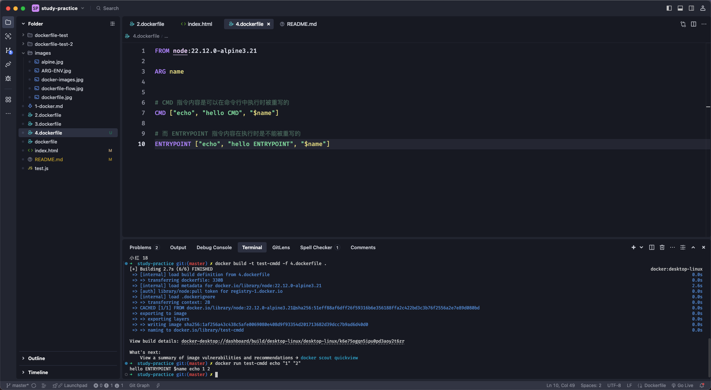
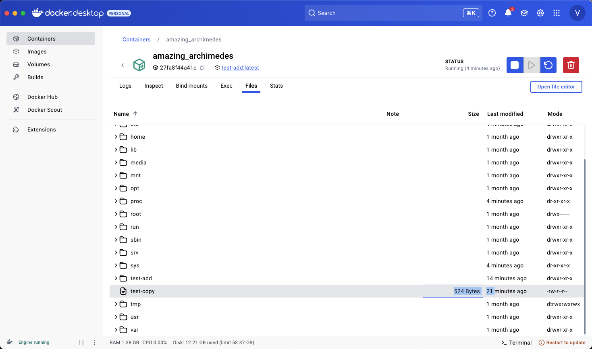

# docker study

拉取项目代码

- git pull

打开 dockerfile-test 项目文件

- cd dockerfile-test

运行 docker 命令构建容器

- docker build -t name:tag .

- `-t` 指定 name:tag

- `.` 当前目录结构

指定 端口 后台运行

- docker run -d -p 3000:3000 --name nest-Contreras name:tag

- `-d` 后台运行

- `-p` 指定端口

- `--name` 指定容器名称

# docker-study

- dockerfile 是在 docker build 时 docker 守护进程进行的 而不是命令行
- 在启动 docker daemon 之后才可以进行 docker build

- 命令行工具 和 docker daemon 交互来实现各种功能

- 比如在 docker build 的时候 会把 dockerfile 和它的构建上下文 (也就是所在目录) 打包发送给 docker daemon 来构建镜像

```csharp
docker build -t name:tag -f filename .
```

- . 为构建的上下文目录 (也可以指定别的命令)
- 镜像自然是越小越好 所以 docker 支持通过 .dockerignore 声明哪些不需要发送给 docker daemon

- 示例

```csharp
*.md
!README.md
node_modules/
[a-c].txt
.git/
.DS_Store
.vscode/
.dockerignore
.eslintignore
.eslintrc
.prettierrc
.prettierignore
```

- 而在 docker build 时会先解析 .dockerignore, 忽略里面的文件
  - 然后再 根据 dockerfile 里面的 FROM WORKDIR ... 执行里面的内容
  - 这一切都是在 docker daemon 启动时(中)执行的
- 把剩余的文件打包发送给 docker daemon 作为上下文来构建产生镜像

- 多阶段构建
  - 将源码目录发送到 docker daemon 中执行 npm run build 来构建产物
  - 之后再 执行 node ./dist/main.js 运行服务

## 提升技巧

- 端口映射、数据卷(volume -v)挂载

```docker
docker run -p 3000:3000 -v /aaa:/bbb/ccc --name xxx-container xxx-image
```

- `-p` 端口映射
- `-v` 指定数据卷挂载 (挂载宿主机/aaa 到容器的 /bbb/ccc 目录 )

- 流程

[!dockerfile](./images/dockerfile.jpg)

```docker
docker run -d -p 9527:9527 --name docker-coeternal docker-test:nest
```

- `-d` 为后台运行
- `-p` 指定端口
- `--name` 指定容器名称
- `docker-test:nest` 执行 docker build 后的 images name:tag

- dockerfile 构建镜像 运行流程

[dockerfile-flow](./images/dockerfile-flow.jpg)

### 使用 alpine 镜像

- alpine 基于 Alpine Linux 的超小型 Docker 镜像
- 该镜像只有 5 MB

[Alpine](./images/alpine.jpg)

### 使用多阶段构建

```docker
# 多阶段构建
FROM node:22.12.0-alpine3.21 AS build-stage

WORKDIR /nest-app

COPY package.json .
# COPY *.lock .

RUN npm config set registry https://registry.npmmirror.com/

RUN npm install -g pnpm

RUN pnpm install

COPY . .

RUN pnpm run build


# production stage

FROM node:22.12.0-alpine3.21 AS production-stage

COPY --from=build-stage /nest-app/dist /nest-app

COPY --from=build-stage /nest-app/package.json /nest-app/package.json

WORKDIR /nest-app

RUN npm config set registry https://registry.npmmirror.com/

RUN npm instal -g pnpm

RUN pnpm install --prod

EXPOSE 9527

CMD ["node", "./dist/main.js"]

```

- 多阶段构建 --prod 只会下载生产环境下的库

  - devDependencies or production
  - 开发依赖 是在开发过程中需要的库 如: jest webpack prettier
  - 生产依赖 是在应用程序运行时实际需要的包
  - 而 pnpm install --prod 的作用 只安装运行时用到的包 完全跳过 dev 的包

- 潜在问题 :

  - 构建过程依赖: 如果应用程序在运行时需要进行任何构建,而相关工具在 dev 中, 可能会导致错误

- 为什么通常不会出错

  - 构架过程: 在 Dockerfile 中, 构建阶段(build-stage) 已经完成了所有需要开发依赖的工作
  - 静态文件: 构建后的文件通常是静态的,不需要开发依赖
  - 正确的依赖分类: 项目中的 package.json 正确区分了开发和生产依赖,那么生产环境应该有所有必要的包

[docker-imags](./images/docker-images.jpg)

### CMD 结合 ENTRYPOINT

- 在 dockerfile 中 CMD 运行命令是可以进行重写的而 ENTRYPOINT 不会被重写
- 在执行 docker run 时 ENTRYPOINT 结合 CMD 使用 ENTRYPOINT 就可以起到一个默认值的作用



### COPY vs ADD

- 在 dockerfile 中 add 和 copy 都是将本地文件拷贝到 docker 镜像中
- add 可以下载文件并解压 copy 只是将文件拷贝到镜像中不做任何操作


